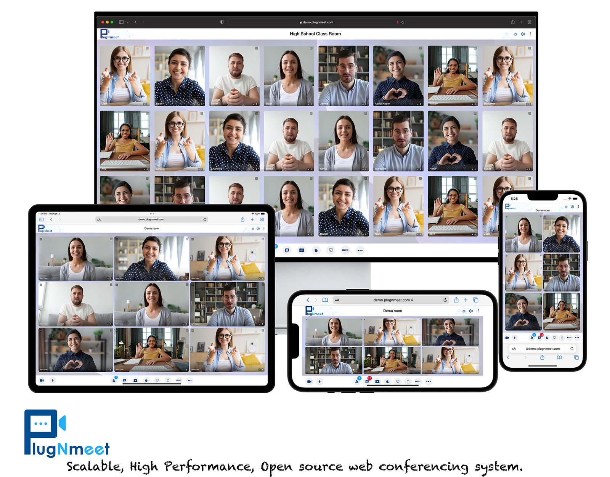

# Plug-N-Meet - Scalable, Open source web conferencing system.

Plug-N-Meet is an open source web conferencing system based on high performance WebRTC
infrastructure [livekit](https://github.com/livekit/livekit-server). Please join us [on Slack](https://join.slack.com/t/plugnmeet/shared_invite/zt-1ex9xaydu-RiN6VunWBHo8UDn2P1XQRg) to discuss your suggestions and/or any issues you may be experiencing.



## Features:

1) Compatible with all devices. Browser recommendation: Google Chrome, Firefox. For iOS: Safari;
2) WebRTC based secured & encrypted communication;
3) Scalable and high performance system written in Go programming language which made it possible to distributed as a
   [single binary](https://github.com/mynaparrot/plugNmeet-server/releases) file!;
4) **Simulcast** and **Dynacast** features will allow you to continue online conferencing even if your internet;
   connection is slow! Supported video codecs: `H264`, `VP8`, `VP9` and `AV1`;
5) Easy integration with any existing website or system;
6) Easy customization with functionality, URL, logo, and branding colors;
7) HD audio, video call and Screen sharing. **Virtual background** for webcams;
8) **Shared notepad** and **Whiteboard** for live collaboration. Can upload, draw & share various office file (pdf, docx, pptx, xlsx, txt etc.) in whiteboard directly;
9) Easy to use **Polls** & voting;
10) Customizable **waiting room**;
11) Various **Lock & control** settings;
12) **Breakout rooms**;
13) Raise hand;
14) Public & private chatting with File sharing;
15) MP4 Recordings;
16) RTMP Broadcasting & RTMP ingress;
17) Speech to text/translation (Powered by [Microsoft Azure](https://learn.microsoft.com/en-us/azure/cognitive-services/speech-service/get-started-text-to-speech?pivots=programming-language-go&tabs=linux%2Cterminal#prerequisites));
18) **End-to-End encryption (E2EE)** (`Supported browsers: browser based on Chromium 83+, Google Chrome, Microsoft Edge, Safari`);
19) A detailed analytics report to assess students' performance in the online classroom;

And many more!

The components of Plug-N-Meet are as follows:

1) [plugNmeet-server](https://github.com/mynaparrot/plugNmeet-server), the main backend server written in **Go** (Golang).

2) [plugNmeet-client](https://github.com/mynaparrot/plugNmeet-client), which is the main interface/frontend. It's built
   with **React** and **Redux**.

3) [plugNmeet-recoder](https://github.com/mynaparrot/plugNmeet-recorder), a **NodeJS** application for recording/rtmp broadcasting
   which is written in **TypeScript**.

#### Demo

https://demo.plugnmeet.com/login.html

## Installation
We've created an easy to install script which can be used to install all the necessary components in few minutes.
Please follow installation guide from here: https://www.plugnmeet.org/docs/installation

## SDKs & Tools

**SDK**

1) [PHP](https://github.com/mynaparrot/plugNmeet-sdk-php)
2) [JavaScript](https://github.com/mynaparrot/plugNmeet-sdk-js) for NodeJS and [Deno](https://github.com/mynaparrot/plugNmeet-sdk-js/tree/main/deno_dist)

Following ready to use extensions/solutions:

1) [Joomla component](https://github.com/mynaparrot/plugNmeet-joomla)
2) [Moodle Plugin](https://github.com/mynaparrot/moodle-mod_plugnmeet)
3) [Wordpress Plugin](https://github.com/mynaparrot/plugNmeet-wordpress)
4) [LTI](https://www.plugnmeet.org/docs/user-guide/lti) 

Docker:

1. [plugnmeet-server](https://hub.docker.com/r/mynaparrot/plugnmeet-server)
2. [plugNmeet-etherpad](https://hub.docker.com/r/mynaparrot/plugnmeet-etherpad)

Server API information can be found in [API doc](https://www.plugnmeet.org/docs/api/intro) section.

## Manually installation

**Requirements:**
1) Livekit configured properly.
2) `plugNmeet-server` configured with Redis.
3) Mariadb server for data storage.
4) (optional) Install `libreoffice` & `mupdf-tools` for office files support in whiteboard.

Create `config.yaml`
from [config_sample.yaml](https://raw.githubusercontent.com/mynaparrot/plugNmeet-server/main/config_sample.yaml) &
change necessary info

***Using docker***

```
docker run --rm -p 8080:8080 \
    -v $PWD/config.yaml:/config.yaml \
    mynaparrot/plugnmeet-server \
    --config /config.yaml \
```

You can also
follow [docker-compose_sample.yaml](https://raw.githubusercontent.com/mynaparrot/plugNmeet-server/main/docker-compose_sample.yaml)
file.

You can manually download server from [release](https://github.com/mynaparrot/plugNmeet-server/releases) page too.

## Development

Please follow [this article](https://www.plugnmeet.org/docs/developer-guide/setup-development) for details.

## Contributing

We welcome your suggestions for improving plugNmeet! Let's chat [on Slack](https://join.slack.com/t/plugnmeet/shared_invite/zt-1ex9xaydu-RiN6VunWBHo8UDn2P1XQRg) to discuss your suggestions and/or PRs. 